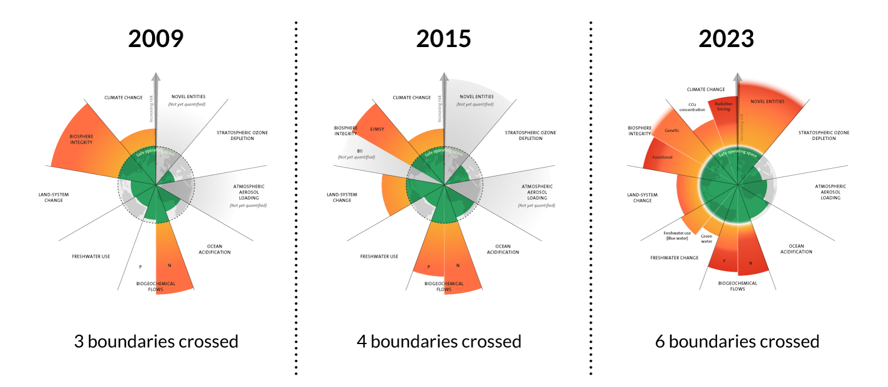

+++
title = "Les enjeux auquels doit répondre le programme"
slug = "reasons"
draft = false
+++

# Une réponse hollistique au franchissement des limites planétaires

Changement climatique = symptome; Dynamique des systèmes; Ensilotage de la pensée

## Les limites planétaires

{{image_with_caption(img_name="planetary-boundaries-over-time.png", alt="Évolution du système des Limites planétaires", width=500, caption="Évolution du système des Limites planétaires (Credit: Azote for Stockholm Resilience Centre, Stockholm University. Based on Richardson et al. 2023, Steffen et al. 2015, and Rockström et al. 2009)")}}
<!--  -->

Mentionner l'étude + graphique

## Anthropocène et grande accélération

Explications + graphs de l'étude

## L'effet rebond et hypothèse de la reine rouge

# Prévoir le pire sans tomber dans le catastrophisme

## La transition énergétique n'a jamais été démontrée

## L'accès aux ressources naturelles au coeur de la géopolitique

## La France : pays (presque) sans pétrole mais avec un empire économique

# Les sciences humaines et les sciences "dures" sur un pied d'égalité

## L'humain est universel, sa condition ne l'est pas

# Une volonté d'émancipations des citoyens

## Émancipation matérielle

## Émancipation intellectuelle